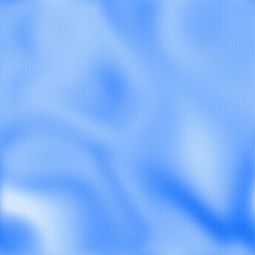

# noisy-video-generator

GPU-accelerated procedural video generator. Produces seamlessly-looping abstract gradient animations using domain-warped fractal noise, rendered via GLSL shaders.

Inspired by the beautiful background on the [OpenAI Codex](https://openai.com/codex/) website -- I wanted something similar for my own site but fully procedural and configurable.



*Low-quality GIF preview -- the actual output is a smooth, high-quality MP4/WebM at full resolution.*

## How it works

1. A GLSL fragment shader renders 4D simplex noise with double domain warping
2. A two-pass separable Gaussian blur creates the soft dreamy look
3. Raw frames are piped directly to ffmpeg for H.264 encoding

Renders 180 frames at 1080x1080 in ~3 seconds on Apple Silicon.

## Requirements

- Python 3.10+
- ffmpeg (system install)

## Setup

```bash
python -m venv .venv
source .venv/bin/activate
pip install -r requirements.txt
```

## Usage

```bash
# Default (soft blue flowing shapes)
python generate.py

# Custom colors
python generate.py --primary "#C41535" --secondary "#FFB8B8" --output warm.mp4

# Longer, slower animation
python generate.py --duration 10 --speed 0.5

# Sharper detail, less blur
python generate.py --octaves 4 --blur 8

# Different composition via seed
python generate.py --seed 99

# WebM output (VP9, much smaller files)
python generate.py --output hero.webm
```

## Options

| Flag | Default | Description |
|---|---|---|
| `--primary` | `#2b7fff` | Primary color (hex) |
| `--secondary` | `#b8d8ff` | Secondary color (hex) |
| `--width` | `1080` | Width in pixels |
| `--height` | `1080` | Height in pixels |
| `--duration` | `6` | Duration in seconds |
| `--fps` | `30` | Frames per second |
| `--speed` | `0.15` | Animation speed multiplier |
| `--noise-scale` | `0.7` | Feature scale (lower = larger shapes) |
| `--octaves` | `2` | fBM octaves (fewer = smoother) |
| `--warp` | `1.5` | Domain warp strength |
| `--grain` | `0.02` | Grain intensity (0-1) |
| `--grain-size` | `1` | Grain particle size in px (1=fine, 2=2x2, 4=chunky) |
| `--blur` | `20.0` | Gaussian blur sigma in px (0 = off) |
| `--seed` | `42` | Deterministic seed |
| `--output` | `output.mp4` | Output file path (.mp4 or .webm) |

## How colors work

You provide a **primary** and **secondary** color. The generator automatically infers a full 6-color palette:

- **Deep** -- primary darkened 15%
- **Primary** -- as provided
- **Mid** -- blend of primary and secondary
- **Secondary** -- as provided
- **Highlight** -- secondary lightened 20%
- **Accent** -- secondary hue-shifted 15deg toward pink

## Technique

The visual effect combines three stacked noise techniques:

- **4D Simplex noise** for seamless time looping (time traces a circle through the 4th dimension)
- **Fractal Brownian Motion** for organic multi-scale detail
- **Double domain warping** for flowing petal/silk shapes (noise output feeds back as coordinate offsets, twice)

## License

MIT
